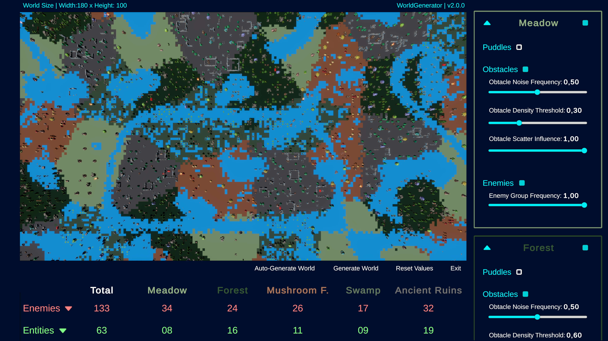
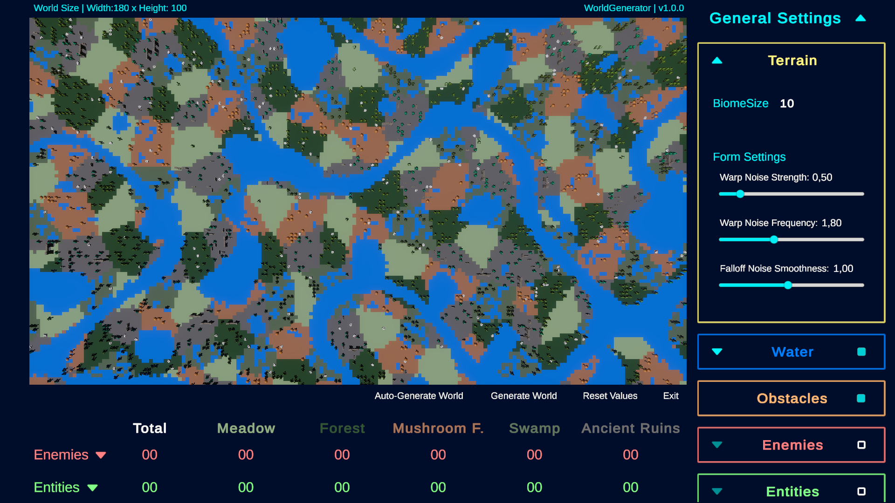
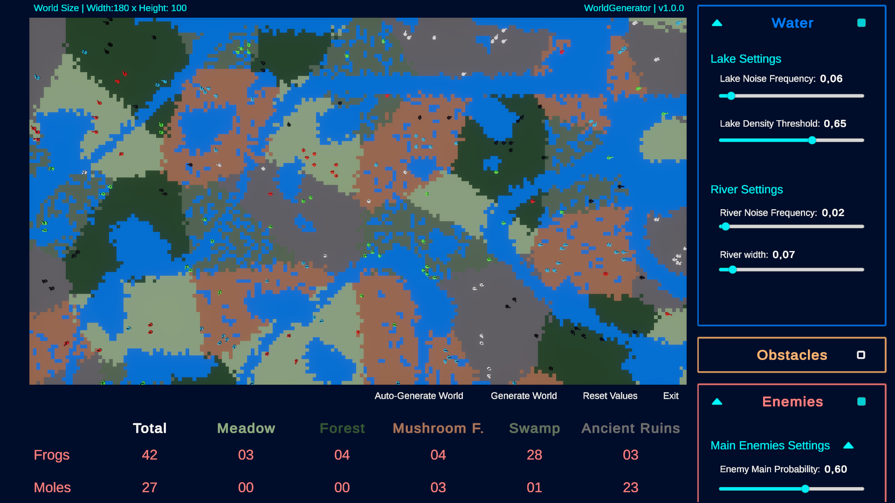

  

# PROCEDURAL GENERATOR – General Project Readme

## Project Overview

This repository contains the custom C# scripts developed for the **Procedural Generator**. This world generator is an integral part of **[Project IV](https://your-link-to-candletales.com)**, a tactical roguelike that is part of a larger overarching project. 

While the main system resides in Project IV, this repository focuses specifically on a **real-time application** of the generator, allowing for the isolated and optimized visualization and dynamic adjustment of biomes, entities, and terrain parameters.

## Important Disclaimer

This repository does **NOT** contain the complete Unity project.  
Assets, 3D models, prefabs, UI graphics, and scenes are **not included**. Only the core logic scripts developed by the author are provided.

**Note:** Scripts for specific gameplay mechanics or external plugins are not included, as they fall outside the scope of this repository, which focuses strictly on the procedural generation architecture.

## Scripts Organization

The scripts are grouped by their core functionality within the generator:

- [**BiomeGenerator.cs**](/Scripts/BiomeGenerator.cs): The core procedural engine. Handles Perlin noise evaluation, chunk-based seed management, world warping, and the distribution logic for water, obstacles, enemies, and entities.
- [**GridManager.cs**](/Scripts/GridManager.cs): Manages the physical grid instantiation. Handles multi-tile object placement, rotation constraints, cell reservation, coordinate mapping, and tracks generation statistics.
- [**CameraControl.cs**](/Scripts/CameraControl.cs): Provides an RTS-style camera system. Features zoom and panning mechanics, dynamic boundaries based on the zoom level, and custom cursor management.
- [**UIWorldGeneratorController.cs**](/Scripts/UIWorldGeneratorController.cs): The bridge between the user and the procedural engine. Controls real-time UI binding, auto-generation toggles, statistics tables, hover legends, and UI visual transitions.

## How to Use

1. Add the scripts to your Unity project under the `Assets/Scripts/` path.  
2. Ensure you have the required packages installed (such as `TextMeshPro` for the UI and `Unity.Cinemachine` for the camera).
3. Assign the required references (`Camera`, `TMP_Text`, `Sliders`, etc.) in the Inspector for the UI and Manager scripts.  
4. Configure the public generation settings (noise frequencies, biome sizes, spawn weights).  
5. Define your own TileTypes and BiomeConfigs to feed the generator's exposed arrays.

## Notes & Recommendations

- Some scripts assume specific UI hierarchies and components (such as `CanvasGroup` or `EventSystems` for hover detection).  
- `CameraControl.cs` requires the Cinemachine package (`Unity.Cinemachine`) to function properly.
- The scripts have been designed with performance in mind (using coroutines for grid building and cache dictionaries for noise evaluation).
- This repository focuses strictly on the procedural programming architecture and does not include graphical assets or scriptable objects.
  
## Watch Procedural Generator

The following screenshots display the procedural generator in action:

  
  
  

You can watch the tool in action here:

- **Youtube:** [Procedural Generator Showcase](https://www.youtube.com/watch?v=YOUR_VIDEO_LINK_HERE)

## Play in Browser

You can try the tool directly from your browser using the WebGL build:

- **GitHub Pages:** [Play Procedural Generator](https://your-username.github.io/your-repo-name/)

## Author & Contact

**Author:** Víctor Rosell Gascó

- **Gmail:** codeby.vrosell@gmail.com  
- **Portfolio:** [codebyvrosell.com](https://codebyvrosell.com)   
- **Twitter:** [@codeby_vrosell](https://x.com/codeby_vrosell)  
- **GitHub:** [@codeby-vrosell](https://github.com/codeby-vrosell)  
- **LinkedIn:** [in/v-rosell](https://linkedin.com/in/v-rosell)

## License

This repository is provided under a strict private license with all rights reserved.                                   
**Its use, copying, modification, or distribution is not allowed** under any circumstances without explicit written permission from the author.

All rights reserved.
